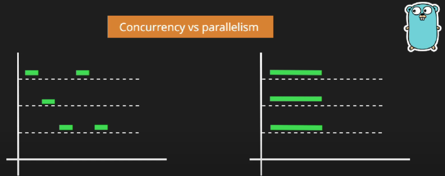

# Go
- Golang is a high-level programming language. It is a well-established language used for a wide range of programming needs
- Robert Griesemer, Rob Pike, and Ken Thompson are the creator of Golang
- Fast compilation and execution
- Readability
- General-purpose language
- Static Typing
- Does not impose Object-Oriented Design
- Concurrency
- Great garbage collection
- Language of Cloud

## GoGyanYatra

# [GoPathshala]

## Content
- [Environment](#environment)
- [Start Project](#start-project-in-go-create-a-module)
- [Variable](#variable)
- [Primitive Data Types](#primitive-data-types)
- [Go Format Specifiers](#Go-Format-Specifiers)
- [Go Memory Allocation](#go-memory-allocation)
- [Constant](#Constant)
- [Pointers](#Pointers)
- [Conditionals](#Conditionals)
- [Switch](#Switch)


- [File Operations](#file-operations)

- [Constants](#constants)
- [Pointers](#pointers)
- [Input](#Input)
- [Conditionals](#conditionals)
- [Switch](#switch)
- [Loops](#loops)
- [Arrays](#arrays)
- [Slices](#slices)
- [Maps](#maps)
- [Structs](#structs)
- [Interfaces](#interfaces)
- [Enums](#enums)
- [Generics](#generics)
- [Functions](#functions)
- [Goroutines](#goroutines)
- [WaitGroup](#waitgroup)
- [Channels](#channels)
- [Mutex](#mutex)
- [Package](#package)
- [Compiled Programs](#compiled-programs)
- [Object-Oriented in Go](#object-oriented-in-go)
- [Missing Features](#missing-features)
- [Running Go Code](#running-go-code)
- [Memory Management](#memory-management)

## Environment
### GOROOT – Go ka installation location
- Ye wo folder hai jahan Go language khud installed hoti hai.
- Yahan standard library aur compiler tools rehte hain.
- Ye automatically set hota hai jab Go install karte ho.
- Windows → C:\Go
- Linux/macOS → /usr/local/go

- Tumhe ise change nahi karna chahiye.

### GOPATH
- Project kahin bhi ho sakta hai (D drive, Desktop, etc.)
- `go.mod` aur `go.sum` ke through dependencies ka version control hota hai
- GOPATH ab “optional” ho gaya hai
- Project ka location → Aap decide karte ho, Go ko `GOPATH/src` me rakhne ki zarurat nahi.
- Dependencies → Go module cache me save karta hai (`$GOPATH/pkg/mod`)
- Binaries → Agar aap go install chalate ho, wo default `GOPATH/bin` me save hoti hai.

## Start project in Go: Create a Module

```bash
mkdir myapp && cd myapp
go mod init github.com/cmrohityadav/myapp

# for learning
go mod init main

```
- **Equivalent of `npm init` in nodeJS**

```bash
go mod init <module_name>
```

- `go mod init` is used to initialize a new module.
-  It creates a new `go.mod` file in the current directory.
-  The `go.mod` file contains information about the module, its dependencies, and the Go version.

### **go.mod file**

- **Equivalent of `package.json` in nodeJS**
- It contains information about the module, its dependencies, and the Go version.


```bash
go mod tidy
```
- **Equivalent of `npm install` in nodeJS**
- `go mod tidy` is used to add missing and remove unused modules.
- It updates the go.mod file to use the latest version of the dependencies.

## To Run go program

```bash
go run <main_file.go>
```
- **Equivalent of `npm run start` in nodeJS**

## Installing package

```bash
go get <package_name>
```
- **Equivalent of `npm install <package_name>` in nodeJS**
- `go get` is not a package manager.
- `go get` is used to download and install packages from remote repositories.
- It does not handle versioning.
- This command fetches the package and its dependencies (if any)

## First Programm
- main function Go program ka entry point hai
```go
package main

import (
    "fmt"
)

func main() {
    fmt.Println("Hello, Go World!")
}
```

## To Build the binary
```bash
go build -o anyBinaryName main.go
```

## Variable
- A variable is the name of an allocated, reserved space in memory

### Valid and Invalid
```bash
# Valid Identifiers

Xyz
val2
val_22
_val22
_VAL234
vAL123
Val_23_ABC

# Invalid Identifiers
22val
for
int
var
continue
string


```

```go

// Explicit
var name string="rohit";


// Implicit type [Type inference (Go infers the type)]
var website = "cmrohityadav.in";

// No var style
// Short declaration (only inside functions)
// := walrus operator
numberOfUser := 30000;


```
### Single Variable Declaration Without Initialization
```go
var <variable_name> <type>

var val_1 int
var val_2 float32
```
### Single Variable Declaration With Initialization
```go
var <variable_name> <type> = {value}

var val_1 int = 10
var val_2 float32 = 20
```

### Multiple Variable Declarations Without Initialization
```go
var <variable_name1>, <variable_name2>......, <variable_nameN> <type> 

var val_1, val_2, val_3 int
```
### Multiple Variable Declarations With Initialization
```go
var <variable_name1>, <variable_name2>......, <variable_nameN> <type> = {value1}, {value2}...., {valueN}

var val_1, val_2, val_3 int = 10, 11, 12

```
###  Declare Variables of Multiple Types
```go
var (
<variable_name1> <type> = {value1}
<variable_name2> <type> = {value2}
<variable_name3> <type> = {value3}
.
.
<variable_nameN> <type> = {valueN}
)


var (
		val_1   int = 10
		message string
		val_2   int = 20
	)

```


## Primitve Data type
- int, float64, byte, string, rune & bool

| Type      | Example  | Description                                                   |
|-----------|---------|---------------------------------------------------------------|
| **int**   | `42`    | Integer (size depends on architecture: 32- or 64-bit)          |
| **float64** | `3.14` | Floating-point number                                         |
| **byte**  | `'A'`   | Alias for `uint8`; typically used for raw data or ASCII chars   |
| **rune**  | `'✓'`   | Alias for `int32`; represents a Unicode code point              |
| **string**| `"hi"`  | Immutable sequence of bytes (UTF-8 encoded text)                |
| **bool**  | `true`  | Boolean logic (`true` or `false`)                               |

- Zero value for `int` = `0` 
- Zero value for `bool` = `false`
- Zero value for `string`=`""`

### int
- int8

- int16

- int32

- int64

### uint

### byte
- alias for int32
### rune
- alias for int32
### uint
- either 32 or 64 bits dependent on the system architecture
### int
- either 32 or 64 bits dependent on the system architecture
## Go Format Specifiers

| Specifier | Description                              | Example                     | Output         |
| --------- | ---------------------------------------- | --------------------------- | -------------- |
| `%v`      | Default format (prints the value)        | `fmt.Printf("%v", 42)`      | `42`           |
| `%T`      | Prints the data **type** of the variable | `fmt.Printf("%T", 42)`      | `int`          |
| `%s`      | String                                   | `fmt.Printf("%s", "Rohit")` | `Rohit`        |
| `%d`      | Integer (base 10)                        | `fmt.Printf("%d", 42)`      | `42`           |
| `%f`      | Floating-point (default precision 6)     | `fmt.Printf("%f", 99.5)`    | `99.500000`    |
| `%.2f`    | Float with **2 decimal places**          | `fmt.Printf("%.2f", 99.5)`  | `99.50`        |
| `%c`      | Character (rune → ASCII)                 | `fmt.Printf("%c", 65)`      | `A`            |
| `%t`      | Boolean (`true`/`false`)                 | `fmt.Printf("%t", true)`    | `true`         |
| `%p`      | Pointer address (hex)                    | `fmt.Printf("%p", &x)`      | `0xc0000140a8` |


- We use `unsafe.Sizeof(variable)` to Check Size of Variable, it return in `Bytes`

## Go Memory Allocation
### Primitive Types (int, float, bool, etc.)
```go
var rollno int
```
- Memory allocated on stack (usually).
- Default value = 0.
- Sometimes compiler may escape it to heap if needed (e.g., returned from function).

```go
var rollno int = 10
```
- Memory allocated on stack (or heap if escape occurs).
- Value initialized = 10
- Rule: Primitive types always get default/assigned value

### Reference Types (map, slice, channel)
```go
var mymap map[int]string
```
- Declaration allocates header only (stack or heap).
- Actual map data not allocated yet → value is nil.
- Trying to use it (e.g., mymap[1] = "a") panics

```go
var mymap = make(map[int]string)
```
- `make` allocates actual data structure in heap.
- Header still exists on stack or heap, depending on escape analysis.
- Now you can safely store key-value pairs.
- `make(T, size, capacity)`
- T → type hota hai (sirf slice, map, ya channel ke liye valid hai).
- size →
    - Slice ke liye →initial length hota hai.
    - Channel ke liye → agar aap buffer banana chahte ho to ye uska buffer size hota hai.
    - Map ke liye → ye optional hint hai (kitni roughly entries expect karte ho).
- capacity →
    - Ye sirf slice ke liye hota hai (optional hai).
    - Agar specify nahi karte, to capacity = size.
    - Map aur channel ke liye ye parameter use nahi hota

| Type    | Allowed Parameters            | Meaning of Parameters                            |
| ------- | ----------------------------- | ------------------------------------------------ |
| Slice   | `make([]T, length, capacity)` | Create slice with length & optional capacity     |
| Map     | `make(map[K]V, hint)`         | Create map with initial capacity hint            |
| Channel | `make(chan T, bufferSize)`    | Create channel with buffer size (0 = unbuffered) |
  
### How Go Allocates and Initializes Different Types
| Type    | Declaration                | Header Memory             | Data Memory        | Default Value | Usable? |
| ------- | -------------------------- | ------------------------- | ------------------ | ------------- | ------- |
| int     | `var x int`                | Allocated (stack or heap) | Allocated          | 0             | ✅       |
| float64 | `var f float64`            | Allocated (stack or heap) | Allocated          | 0.0           | ✅       |
| bool    | `var b bool`               | Allocated (stack or heap) | Allocated          | false         | ✅       |
| string  | `var s string`             | Allocated (stack or heap) | Heap when assigned | ""            | ✅       |
| map     | `var m map[K]V`            | Allocated (stack or heap) | Not allocated      | nil           | ❌       |
| map     | `var m = make(map[K]V)`    | Allocated (stack or heap) | Heap allocated     | ready         | ✅       |
| slice   | `var s []T`                | Allocated (stack or heap) | Not allocated      | nil           | ❌       |
| slice   | `var s = make([]T, n)`     | Allocated (stack or heap) | Heap allocated     | ready         | ✅       |
| channel | `var ch chan T`            | Allocated (stack or heap) | Not allocated      | nil           | ❌       |
| channel | `var ch = make(chan T, n)` | Allocated (stack or heap) | Heap allocated     | ready         | ✅       |
| pointer | `var p *T`                 | Allocated (stack or heap) | Not allocated      | nil           | ❌       |


### Go new Keyword
- `new` is a built-in Go function used to allocate memory for any type (primitive, struct, array, etc.).
- It always allocates zero-initialized memory.
- Returns a pointer to the allocated memory (*T).
- Important: new does not call any constructor. Only memory allocation and zero-initialization happen
```go
p := new(Type)
```

| Type              | Zero Value          |
| ----------------- | ------------------- |
| int, int32, int64 | 0                   |
| float32, float64  | 0.0                 |
| bool              | false               |
| pointer           | nil                 |
| struct            | all fields zeroed   |
| array             | all elements zeroed |

#### Why new is not normally used for channel, map, slice
- Channel, map, and slice are reference types.
- new only allocates memory for a pointer/header, not the underlying data.
- Using new for these types creates a pointer to a nil reference → not ready to use.
- Sirf header/pointer memory allocate hoti hai → zero-initialized/zero value (nil)
- Actual data structure allocate nahi hoti → cannot use yet
```go
// slice
s := new([]int) // type = *[]int
fmt.Println(*s) // nil
(*s)[0] = 10    // ❌ panic: index out of range

// Header is allocated, but backing array not allocated.

s := make([]int, 5) // allocates header + backing array
s[0] = 10           // ✅ works


// map

m := new(map[int]string) // type = *map[int]string
fmt.Println(*m)          // nil
(*m)[1] = "a"            // ❌ panic: assignment to entry in nil map


m := make(map[int]string) // allocates map data
m[1] = "a"               // ✅ works


//channel
ch := new(chan int) // type = *chan int
*ch <- 5           // ❌ panic: send on nil channel


ch := make(chan int, 10) // allocates channel buffer
ch <- 5                  // ✅ works


```

## Constant
- constant is a name that’s bound to a fixed value at compile time.
Once defined, it cannot change during the lifetime of the program

```go
// Untyped constant
const pi=3.14;

// Typed constant
const maxUser int=420;

// Multiple constants in a block
const (
    portNumber=4000;
    greeting="Good Morning"
)


// iota – Constant Generator

type Weekday int

const (
    Sunday Weekday = iota
    Monday
    Tuesday
    Wednesday
    Thursday
    Friday
    Saturday
)

```
- if we use **first Letter Capital** the it like: **Public**
```go
const LoginToken string = "abcdefg"
```

- numberOfUser := 30000 // This code is not allow in public,it can be only use in method / function


## Pointers
- A pointer is a variable that stores the memory address of another variable
- Instead of copying a value, you pass around a “reference” to where that value lives in memory
- Think of it like sharing a Google Drive link instead of sending a huge video file. You can edit the video in one place and everyone sees the update
### compare with c/c++
```bash
# c/c++
int* pMyPointer
int *pMyPointer

# go
var pMyPointer *int

# note: here’s no alternative syntax
var name *Type 
```
- get address/reference : &anyVariable
- dereference: *anyPointerVariable
### example of pointers
```go
x := 42
fmt.Println(x) //42
fmt.Println(&x) // 0xc0000120a0 
p := &x        // &x → address of x
fmt.Println(p) // 0xc0000120a0
fmt.Println(*p) // 42
y := *p        // *p → value stored at that address (42)
fmt.Println(y) //42
```
```go
var x int          // declare x as int, default value is 0
    x = 42             // assign a value

    fmt.Println(x)     // 42  (value of x)

    fmt.Println(&x)    // 0xc0000120a0 (address of x — varies each run)

    var p *int         // declare p as pointer to int
    p = &x             // assign address of x to p
    fmt.Println(p)     // same as &x (pointer value)

    fmt.Println(*p)    // 42  (value stored at the address p points to)

    var y int          // declare y as int
    y = *p             // copy the value pointed to by p
    fmt.Println(y)     // 42
```
- **func changeByReference(&num int) is: ❌ Invalid in Go**
```bash
C++	void f(int &num) → call with f(x)

C	void f(int *num) → call with f(&x)
Go	func f(num *int) → call with f(&x)
```

## Input

### fmt.Scan
```go
func main() {
	var name string
	fmt.Print("Enter your name: ")
	fmt.Scan(&name)
	fmt.Println("Hello User ,", name)
}
```
- fmt.Scan(&name) → reads a word from standard input (stdin)
- &name → pointer where the value will be stored
- Stops reading on space or newline
- **Scan Multiple Values**
```go
    var mobile int;
	var fullName string;

	fmt.Print("Enter your fullname and mobile number: ");
	fmt.Scan(&fullName, &mobile);

	fmt.Printf("\n User Name: %s and Mobile Number: %d",fullName,mobile);

```

### fmt.Scanln

### fmt.Scanf


## Conditionals

### Basic if Statement
```go
age:=10;

if age>=18 {
    fmt.Println("You are Adult");
}
```
- Condition must evaluate to a boolean (true or false).

- Curly braces `{}` are `mandatory` even for a single line of code.

- No parentheses around the condition

### if-else Statement

```go
score:=65;

if score>=90 {
    fmt.Println("Grade A");
} else if score>=75 {
    fmt.Println("grade B");
} else if score>=50 {
    fmt.Println("grade C");
}else {
    fmt.Println("Grade F");
}

```
- `else if` handles multiple conditions sequentially

### Short Statement in if

- Go allows you to declare a variable inside the if condition
- which is only visible inside that block

```go
if temp:=30 ; temp>40 {
    fmt.Println("Its a hot day");
} else {
    fmt.Println("It cmfortable");
}
```
- temp exists only inside this if-else block.
- Use logical operator when possible [&&(and),||(or),!(not)]
- Go does not have ternary operator, you will have to use normal if else

## Switch

### Basic Switch
```go
day := "Tuesday"

    switch day {
    case "Monday":
        fmt.Println("Start of the week")
    case "Tuesday":
        fmt.Println("Second day of the week")
    case "Friday":
        fmt.Println("Almost weekend")
    default:
        fmt.Println("Midweek days")
    }
```
- default is optional but recommended
- `No break needed`: Go automatically stops after the first match

### Multiple Cases in One Line
```go
score := 85

switch {
case score >= 90:
    fmt.Println("Grade A")
case score >= 75 && score < 90:
    fmt.Println("Grade B")
case score >= 50 && score < 75:
    fmt.Println("Grade C")
default:
    fmt.Println("Grade F")
}
```
- Go allows condition expressions, not just simple values.
- Great for ranges or complex checks

### Type Switch (Advanced, for Interfaces)
```go
var val interface{} = 42

switch v := val.(type) {
case int:
    fmt.Println("Integer:", v)
case string:
    fmt.Println("String:", v)
default:
    fmt.Println("Unknown type")
}
```
- Checks the dynamic type of an interface.
- Essential for writing generic libraries or handling polymorphic data

### Fallthrough
```go
num := 2

switch num {
case 1:
    fmt.Println("One")
case 2:
    fmt.Println("Two")
    fallthrough
case 3:
    fmt.Println("Three")
}

```
- fallthrough forces execution to the next case, even if it doesn’t match.
- Use carefully—most of the time, Go’s default “break after case” is safer


## Loops
- Unlike some languages, Go has only one loop keyword: **for**
- Everything else is just a variation

### Basic for loop
```go
for i:=0; i<5; i++ {
    fmt.Println("Iteration : ",i);
}
```
### While Style Loop
```go
count:=0;
for count<5 {
    fmt.Println("counter: ",count);
}
```
### Infinite Loop
```go
for{
    fmt.PrintLn("Hello")
}
```
### Loop with **range** 
- Over Slices, Arrays, Maps, Strings,channels
- range is Go’s idiomatic way to iterate collections
- Returns two values: index/key and value
- **break** → exit the loop immediately

- **continue** → skip the rest of the current iteration and move to the next
```go
for i:=range 11{
    fmt.Println(i);
}
//0,1,2....10
```

```go
nums := []int{10, 20, 30, 40}
for index, value := range nums {
    fmt.Println("Index:", index, "Value:", value)
}
```

## Arrays
- An array is a fixed-size, ordered collection of elements all of the same type
- Define size (mandatory in Go)
```go
var arr [4]int
// array length
fmt.Println(len(arr));

arr[0]=1;

fmt.Println(arr[0]);

fmt.Println(arr);


var vals [4]bool;
vals[2]=true;
fmt.Println(vals);
// [false false true false]
// bydefault all will false
// int -> 0, string-> "",bool ->false

nums:=[3]string{"rohit","yadav","yadav"};


// 2D array
nums:=[2][2]int{{3,4},{5,6}};


```
## Slice
- Dynamic Array
```go
nums:=[]string{"rohit","yadav"};


var rollNo []int;
// Above uninitialized slice is nill

var prices=make([]int,2);
//it set all 2 element to Zero: eg.  [0 0]

fmt.Println(cap(prices));
// capacity -> maximium numbers of elements can fit

```


## Map
- A map is Go’s built-in hash table or dictionary type.
- It stores data as key–value pairs so you can quickly look up a value by its key

### create
```go
//Using make
m:=make(map[keyType]keyValueType);
m:=make(map[int]string);

// using Map literal
m:=map[string]int{"rohit":1,"yadav":2};

// declareing then assigning
var m map[string]int;
m=make(map[string]int);


```
### Access
```go 
fmt.Println(m["rohit"]);
// if key does not exists in the map then it returns ZERO value

```
### Add/update
```go 
m["india"]=91;

```
### Iteration
```go
for k,v:=range m {
    fmt.Printf("For key %v, value is %v\n", key, value)
}

```

### Deletion
```go
delete(m,"rohit");
```
### Checking key
```go
m:=map[int]string{1:"rohit",2:"yadav"};

k,ok:=m[1];
// k:value of key,ok:bool
if ok {
    fmt.Println("all okay");
}else {
    fmt.Println("Not Okay");
}
```


## Struct
- Struct is a way to group together different pieces of data (fields) under one name
- Think of it like a blueprint for an object
```go
package main

import (
    "fmt"
    "time"
)

// Define the struct
type order struct {
    id        string
    amount    float32
    status    string
    createdAt time.Time // nanoseconds precision
}

func main() {
    // ===============================
    // WAY 1: Zero value / default struct
    // ===============================
    var mobileOrder order
    mobileOrder.id = "101"
    mobileOrder.amount = 12000.50
    mobileOrder.status = "pending"
    mobileOrder.createdAt = time.Now()
    fmt.Println("Mobile Order:", mobileOrder)

    // ===============================
    // WAY 2: Struct literal with field names
    // ===============================
    laptopOrder := order{
        id:        "64",
        amount:    50000.14,
        status:    "on the way",
        createdAt: time.Now(),
    }
    fmt.Println("Laptop Order:", laptopOrder)

    // ===============================
    // WAY 3: Struct literal without field names
    // Must follow the order of fields in struct!
    // ===============================
    bookOrder := order{"201", 999.99, "delivered", time.Now()}
    fmt.Println("Book Order:", bookOrder)

    // ===============================
    // WAY 4: Using pointer to struct
    // ===============================
    penOrder := &order{
        id:        "301",
        amount:    49.99,
        status:    "shipped",
        createdAt: time.Now(),
    }

    // Go auto-dereferences
    fmt.Println("Pen Order (pointer):", penOrder)
    fmt.Println("Pen Order ID via pointer:", penOrder.id) 
    // Dereferencing is automatic for struct field access

    // Modifying through pointer
    penOrder.status = "delivered"
    fmt.Println("Updated Pen Order:", penOrder)

    // ===============================
    // WAY 5: Using new() to create pointer to struct
    // ===============================
    bagOrder := new(order) // returns *order
    bagOrder.id = "401"
    bagOrder.amount = 1200.50
    bagOrder.status = "pending"
    bagOrder.createdAt = time.Now()
    fmt.Println("Bag Order (new):", bagOrder)

    // ===============================
    // WAY 6: Anonymous struct
    // ===============================
    anonymousOrder := struct {
        id     string
        amount float32
    }{
        id:     "501",
        amount: 350.75,
    }
    fmt.Println("Anonymous Order:", anonymousOrder)

    // ===============================
    // WAY 7: Using methods with struct
    // ===============================
    laptopOrder.PrintSummary()
}

// Method attached to struct
func (o order) PrintSummary() {
    fmt.Printf("Order %s of amount %.2f is %s\n", o.id, o.amount, o.status)
}

// (o order) → value receiver → gets a copy of the struct.

// If you change o.status inside this method, the original struct won’t change.

// (o *order) → pointer receiver → gets the address, can modify original struct

```

- **If x is a pointer to a struct, x.f is shorthand for (*x).f**

- Just like constructor in other programming language
```go
func newOrder(id string,amount float32,status)*orde{
    // initial setup goes here...
    myOrder:=order{
        id:id,
        amount:amount,
        status:status,
    }
    return &myOrder;
}

```
### Struct Embedding
```go
type Address struct {
    City  string
    State string
}

type Person struct {
    Name string
    Age  int
    Address   // embedded struct (no field name)
}

``` 
## Interfaces
- It is just Contract
- An interface is a type that specifies a set of method signatures—just the method names and parameters, no code
- If a type (a struct, usually) has all those methods with the same signatures, it automatically satisfies the interface.
- No keywords like “implements” are needed

```go
package main

import "fmt"

// 1. Define the interface (the contract)
type Speaker interface {
    Speak() string
}

// 2. Create types that match the contract
type Person struct{}
func (p Person) Speak() string {
    return "Hello, I'm a person."
}

type Dog struct{}
func (d Dog) Speak() string {
    return "Woof!"
}

// 3. Use the interface as a parameter
func SaySomething(s Speaker) {
    fmt.Println(s.Speak())
}

func main() {
    p := Person{}
    d := Dog{}

    SaySomething(p)  // works
    SaySomething(d)  // works
}


```

| Concept              | C++                               | Go                                          |
|----------------------|------------------------------------|---------------------------------------------|
| Declare behaviour    | Pure virtual class                | `interface`                                  |
| Explicit inheritance | `class Circle : public Shape`     | Nahi hota (automatic / implicit)             |
| Method override      | `override` keyword optional       | Bas method signature match karo              |
| Multiple inheritance | Limited / complex                 | Easy, ek type multiple interfaces satisfy kar sakta |


## Enums
- Go doesn’t have a native enum keyword like C, Java, or Rust.
- Instead, Go gives you simple primitives—constants + iota + custom types—that you combine to achieve the same (and often better) result.
```go
// Step 1: create a named type
type OrderStatus int

// Step 2: declare constants using iota
const (
    Pending OrderStatus = iota  // 0
    Processing                  // 1
    Shipped                     // 2
    Delivered                   // 3
    Cancelled                   // 4
)

```

## Generics
- Generics let you write one function or type that works with many data types, instead of writing the same code multiple times
- Generics = code that works for many types
### Without generics
- two functions that do the exact same thing, only the types differ
```go
func SumInt(a, b int) int {
    return a + b
}
func SumFloat(a, b float64) float64 {
    return a + b
}

```
### With generics
- One function now works for both int and float64
- T is a type parameter—a placeholder for any type that matches the rule int | float64.
```go
func Sum[T int | float64](a, b T) T {
    return a + b
}
```


## Functions
```go
func add(a int,b int) int{
    return a+b
}

// if same datatype of parameter
func add(a ,b int) int{
    return a+b
}

```

```go
// Multiple Returns
func multipleReturn()(string,string,int){
    return "first","second",3
}

first,second,third:=multipleReturn();


// Using the Blank Identifier: _
// If you don’t need all the results:

_, second,third := multipleReturn();
fmt.Println(second, number);

```

### Variadic Function
- Accepts any number of arguments of the same type.
- Inside, the parameter behaves like a slice

```go
func sum(nums ...int) int {
    total := 0
    for _, n := range nums {
        total += n
    }
    return total
}
fmt.Println(sum(1,2,3,4)) // 10
```

### Anonymous / Closure
- Functions without a name can be stored in variables
- They can also close over variables from the surrounding scope
```go
square := func(x int) int {
    return x * x
}
fmt.Println(square(4)) // 16
```

### Functions in Go are first-class citizens
#### Assign to a Variable

```go
package main
import "fmt"

func greet(name string) string {
    return "Hello, " + name
}

func main() {
    // assign function to a variable
    sayHello := greet
    fmt.Println(sayHello("Rohit")) // Hello, Rohit
}
```

#### Pass a Function as an Argument
```go
func operate(a, b int, anyFunName func(int, int) int) int {
    return anyFunName(a, b)
}

func main() {
    add := func(x, y int) int { return x + y }
    fmt.Println(operate(3, 4, add)) // 7
}
```
#### Return a Function (Closure)
```go 
func multiplier(factor int) func(int) int {
    return func(x int) int {
        return x * factor
    }
}

func main() {
    times2 := multiplier(2)
    fmt.Println(times2(5)) // 10
}
```
- func(int) int: Return type: instead of a simple type (like int), it returns a function.
That returned function itself takes one int and returns an int


## Goroutines
- Think of a goroutine as a tiny, lightweight worker that Go can run at the same time as your main program
- They’re like “threads,” but cheaper and easier
- You can start thousands of them without eating much memory

- `do not communicate by sharing memroy..,instead,share memory by communicating`
## Wait Group
### The Problem WaitGroup Solves
```go
package main

import (
    "fmt"
    "time"
)

func worker(id int) {
    time.Sleep(1 * time.Second)
    fmt.Println("Worker", id, "done")
}

func main() {
    for i := 1; i <= 3; i++ {
        go worker(i)
    }
    // main returns immediately → goroutines may not finish
}

```
- Sometimes you’ll see no output, because main ends and the process exits
### Meet sync.WaitGroup
- A WaitGroup is like a counter + gate
- You “add” the number of goroutines you plan to start
- Each goroutine “done” lowers(-) the counter
- Wait() blocks until the counter hits zero
### Basic Steps
1. Create a WaitGroup.
2. Add the number of goroutines.
3. Run goroutines and call Done() when finished.
4. Wait in main until all are done

```go
package main

import (
    "fmt"
    "sync"
    "time"
)

func worker(id int, wg *sync.WaitGroup) {
    defer wg.Done() // mark this worker as finished when the function ends
    time.Sleep(time.Second)
    fmt.Println("Worker", id, "done")
}

func main() {
    var wg sync.WaitGroup

    for i := 1; i <= 3; i++ {
        wg.Add(1)               // step 1: increment counter
        go worker(i, &wg)       // step 2: start goroutine
    }

    wg.Wait()                   // step 3: block until all Done() calls happen
    fmt.Println("All workers finished!")
}

```

## Channels
- A goroutine is a lightweight, concurrent worker
- If several goroutines run at the same time, they often need to talk to each other
- Without a safe way to communicate, you’d have to share variables and worry about “race conditions.”
That’s where channels come in
- Think of a `channel` as a `pipe` that lets one goroutine send a value and another goroutine receive it.
- Ek goroutine data send karega, aur doosra receive karega — bina kisi global variable ke
```go
ch := make(chan int) // create a channel which carries int type data
// chan int → channel carrying integers
// make → channel banane ke liye use hota hai
```

### Unbuffered Channel
- Unbuffered channel ka matlab — send aur receive dono ek saath hone chahiye.
Agar ek side missing ho, to blocking hota hai
- Go ka unbuffered channel ek direct wire jaisa hota hai —
jisme sender aur receiver dono ek saath online hone chahiye tabhi data bheja/lia ja sakta hai
```
- Scene Imagine Karo:

- Soch lo 2 log hain —
👉 Sender bhai
👉 Receiver bhai
Aur beech me ek pipe (channel) laga hua hai

Sender bhai kehta hai:
“Main 10 bhejna chahta hoon channel me.”

"ch <- 10"

Lekin Go kehta hai:
“Thoda ruk ja bhai 😅 — main tab tak tera message aage nahi bhej sakta jab tak koi receive karne wala ready na ho.”

Is waqt Sender block ho jaata hai (ruk jaata hai).

Jab Receiver bhai kehta hai:
“Ab main ready hoon, mujhe de data.”

val := <-ch

Tab Go dono ko ek saath jod deta hai

Sender --> (data: 10) --> Receiver

Is process ko kehte hain "Synchronization"

Unbuffered channel me send aur receive dono ek time par hone chahiye.
Agar ek bhi side absent hai → pura system ruk jaata hai (blocking ho jaata hai).

```
```
   [Goroutine 1 - Sender]          [Goroutine 2 - Receiver]
            |                                |
            |  ch <- 10                      |  val := <-ch
            |   (waits till receiver ready)  |
            |--------------------------------|
                        |
                     Channel (unbuffered)
                        |
                        V
              (Data transferred instantly)

```
- Sender ch <- 10 karega, lekin tab tak rukega jab tak receiver ready na ho.
- Jab receiver <-ch karega, dono sync ho jaate hain aur data transfer ho jaata hai.
- Blocking behavior hai


```go
package main

import "fmt"

func main() {
    ch := make(chan int) // unbuffered channel

    // Sender goroutine
    go func() {
        fmt.Println("Sending value...")
        ch <- 10 // this will block until someone receives
        fmt.Println("Sent!")
    }()

    // Receiver
    fmt.Println("Receiving value...")
    val := <-ch // will unblock the sender
    fmt.Println("hello rohit here ")
    fmt.Println("Received:", val)
}


// OUTPUT

// Receiving value...
// Sending value...
// Sent!
// hello rohit here 
// Received: 10


```
- Jab tak receiver <-ch ready nahi hota, sender ch <- 10 pe ruk jaata hai.

- Jab receiver ready hota hai, dono ek saath proceed karte hain.

- Isko kehte hain blocking behavior.


### Buffered Channel
- Buffered channel me aap n number of values rakh sakte ho bina immediately receive kiye hue
```go
ch := make(chan int, 3) // buffer size 3
```
- Jab tak buffer full nahi hota, send block nahi hota
- Jab buffer empty nahi hota, receive block nahi hotta

```
Buffered channel ke paas andar ek chhota storage box (queue) hota hai —
jisme data temporarily store ho sakta hai

Matlab sender ko har baar receiver ka wait nahi karna padta.
Go automatically data ko channel ke buffer me daal deta hai


Scene Imagine Karo:
Soch lo tumhare paas ek box hai jisme 3 slot hain (capacity = 3).

[   ] [   ] [   ]   ←  Empty slots initially


Sender bhejta hai pehla item:
ch <- 10

Box me jagah hai → data store ho gaya → sender aage badh gaya
[10] [   ] [   ]

Sender bhejta hai aur data:
ch <- 20
ch <- 30

Ab box full ho gaya.
[10] [20] [30]

Sender ne 3 items bhej diye bina kisi wait ke.

Ab sender agar aur bhejta hai:
ch <- 40

Ab box full hai → sender block ho jaata hai (ruk jaata hai).
Go kehta hai: “Pehle koi ek item nikaale, tab main naya daalunga.”


Receiver aata hai:
val := <-ch

Receiver ne pehla item (10) nikaal liya:
[   ] [20] [30]

Ab ek slot khali hua → sender fir se data bhej sakta hai (40).


| Step             | Action                                         | Result |
| ---------------- | ---------------------------------------------- | ------ |
| Buffer not full  | Sender send kar sakta hai freely               |        |
| Buffer full      | Sender block ho jaata hai                      |        |
| Buffer not empty | Receiver receive kar sakta hai freely          |        |
| Buffer empty     | Receiver block ho jaata hai                    |        |
| Receiver nikaale | Ek slot khali hota hai, sender resume hota hai |        |


Isiliye isko partially blocking behavior kehte hain —
kabhi free, kabhi block, depending on buffer capacity

```

```
      [Sender Goroutine]                [Receiver Goroutine]
             |                                 |
             | ch <- 1                         | val := <-ch
             | ch <- 2                         | val := <-ch
             | ch <- 3                         |
             |                                 |
             V                                 V
      -------------------------------
      | Buffer Queue: [1] [2] [3]   |   (Capacity = 3)
      -------------------------------


```
- Jab tak buffer full nahi hota, sender ko wait nahi karna padta.
- Jaise hi buffer full ho gaya (3 items), agla send block ho jaata hai
- Receiver jab ek item nikaalega, space khali hoga, aur sender fir se send kar sakta hai
- Partially blocking behavior hota hai


```go
package main

import "fmt"

func main() {
    ch := make(chan int, 2) // buffer size 2

    ch <- 10
    fmt.Println("Sent 10")

    ch <- 20
    fmt.Println("Sent 20")

    // Buffer full hai, ab next send block karega jab tak koi receive nahi kare
    go func() {
        ch <- 30
        fmt.Println("Sent 30")
    }()

    fmt.Println("Receiving...")
    fmt.Println(<-ch)
    fmt.Println(<-ch)
    fmt.Println(<-ch)
}


// OUTPUT:

// Sent 10
// Sent 20
// Receiving...
// 10
// 20
// Sent 30
// 30

```
| Type       | Send Blocks When     | Receive Blocks When |
| ---------- | -------------------- | ------------------- |
| Unbuffered | Until receiver ready | Until sender ready  |
| Buffered   | When buffer full     | When buffer empty   |


### Channel Direction (Send-only / Receive-only)
- Sometimes a function sirf send karega, ya sirf receive karega.
Is case me hum restricted channel use karte hain
```go
func send(ch chan<- int) { // send-only
    ch <- 100
}

func receive(ch <-chan int) { // receive-only
    fmt.Println(<-ch)
}

func main() {
    ch := make(chan int)
    go send(ch)
    receive(ch)
}
```
### Close a Channel
- Agar aapko batana hai ki ab aur data nahi aayega channel se, to aap channel ko close karte ho

```
Sender Goroutine
     |
     | close(ch)
     V
  Channel Closed
     |
     |------> Receiver 1 gets data till available
     |------> After data: zero-value + ok=false
```
- ok == false → matlab channel close ho gaya hai aur aur data nahi bacha.

val → zero-value of type (int ke liye 0)

```go
val, ok := <-ch
if !ok {
    fmt.Println("Channel closed")
}

```


```go
package main

import "fmt"

func main() {
    ch := make(chan int, 2)
    ch <- 1
    ch <- 2
    close(ch)

    for val := range ch {
        fmt.Println(val)
    }
}


// OUTPUT:
// 1
// 2

```

### Select Statement (Multiple Channels Handling)
- Agar multiple channels hain, aur aapko jo pehle ready ho uska data lena hai — use select karte hain
```go
package main

import "fmt"

func main() {
    ch1 := make(chan string)
    ch2 := make(chan string)

    go func() {
        ch1 <- "Hello from ch1"
    }()
    go func() {
        ch2 <- "Hi from ch2"
    }()

    select {
    case msg1 := <-ch1:
        fmt.Println(msg1)
    case msg2 := <-ch2:
        fmt.Println(msg2)
    }
}

```
- select wait karta hai jab tak koi ek channel ready na ho
- Select basically dono channels pe ek hi time me nazar rakhta hai.
- Jaise hi koi channel ready hota hai, uska case execute ho jaata hai.


### Deadlock Situation

- Deadlock tab hota hai jab channel ke sender ya receiver dono hi block ho gaye aur koi bhi proceed nahi kar raha

```
[Goroutine Main]
     |
     | ch <- 10   (no receiver waiting)
     |
     X ❌ Deadlock!
```

```go
func main() {
    ch := make(chan int)
    ch <- 1 // no receiver
}
```


```go
ch := make(chan int)     // channel that carries int
// You use make to create it, just like a slice or map.

// Send a value
ch <- 42    // send 42 into the channel


// Receive a value
v := <- ch  // take a value out of the channel


```


## Mutex
- Mutex stands for Mutual Exclusion
- It’s like a key to the whiteboard
- Only the person holding the key can write
- Everyone else must wait until the key is returned


## File
- In Go, whenever you want to open, read, or write files, you use the os package

### Package Functions (os)
| Function | Description |
|----------|-------------|
| `Create(name string) (*File, error)` | Creates a new file (truncates if exists). |
| `Open(name string) (*File, error)` | Opens a file for reading. |
| `OpenFile(name string, flag int, perm FileMode) (*File, error)` | Opens a file with specific flags and permissions. |
| `Mkdir(name string, perm FileMode) error` | Creates a single directory. |
| `MkdirAll(path string, perm FileMode) error` | Creates a directory path recursively. |
| `Remove(name string) error` | Deletes a file or empty directory. |
| `RemoveAll(path string) error` | Deletes a directory and all its contents. |
| `Rename(oldpath, newpath string) error` | Renames a file or directory. |
| `ReadDir(name string) ([]DirEntry, error)` | Reads directory entries. |
| `Stat(name string) (FileInfo, error)` | Returns file info. |
| `Lstat(name string) (FileInfo, error)` | Like Stat, but does not follow symlinks. |
| `Chmod(name string, mode FileMode) error` | Changes file permissions. |
| `Chown(name string, uid, gid int) error` | Changes file owner. |
| `Chtimes(name string, atime, mtime time.Time) error` | Changes access/modification time. |
| `Getwd() (dir string, err error)` | Returns current working directory. |
| `Chdir(dir string) error` | Changes working directory. |
| `Hostname() (name string, err error)` | Returns host machine name. |
| `UserHomeDir() (string, error)` | Returns user’s home directory. |
| `Getenv(key string) string` | Gets environment variable. |
| `Setenv(key, value string) error` | Sets environment variable. |
| `Unsetenv(key string) error` | Deletes environment variable. |
| `Environ() []string` | Returns all environment variables. |
| `TempDir() string` | Returns the default temp directory. |
| `CreateTemp(dir, pattern string) (*File, error)` | Creates a temp file. |
| `StartProcess(name string, argv []string, attr *ProcAttr) (*Process, error)` | Starts a new process. |
| `Getpid() int` | Returns current process ID. |
| `Getppid() int` | Returns parent process ID. |
| `FindProcess(pid int) (*Process, error)` | Finds a process by PID. |

---

#### Create
```go
func Create(name string) (*os.File, error)
```
- Creates a new file. Truncates if the file already exists.  
- **Parameters:** `name string` → path of new file.  
- **Returns:**  
  - `*os.File` → writable file handle.  
  - `error` → non-nil if creation fails.

```go
f, err := os.Create("newfile.txt")
if err != nil {
    log.Fatal(err)
}
defer f.Close()
```

#### Open
```go
func Open(name string) (*os.File, error)
```
- Opens a file for reading.  
- **Parameters:** `name string` → path to file.  
- **Returns:**  
  - `*os.File` → read-only file handle.  
  - `error` → non-nil if opening fails.

```go
f, err := os.Open("example.txt")
if err != nil {
    log.Fatal(err)
}
defer f.Close()
```

#### OpenFile
```go
func OpenFile(name string, flag int, perm os.FileMode) (*os.File, error)
```
- Opens a file with specific flags and permissions.  
- **Parameters:**  
  - `name string` → file path  
  - `flag int` → mode (e.g., `os.O_RDONLY`, `os.O_CREATE|os.O_WRONLY`)  
  - `perm os.FileMode` → file permissions  
- **Returns:**  
  - `*os.File` → file handle  
  - `error` → non-nil if opening fails

```go
f, err := os.OpenFile("log.txt", os.O_APPEND|os.O_CREATE|os.O_WRONLY, 0644)
if err != nil {
    log.Fatal(err)
}
defer f.Close()
f.WriteString("New log entry\n")
```

#### Mkdir
```go
func Mkdir(name string, perm os.FileMode) error
```
- Creates a single directory.  
- **Parameters:** `name string`, `perm os.FileMode`  
- **Returns:** `error` → non-nil if creation fails

```go
err := os.Mkdir("testdir", 0755)
if err != nil {
    log.Fatal(err)
}
```

#### MkdirAll
```go
func MkdirAll(path string, perm os.FileMode) error
```
- Creates a directory path recursively.  
- **Parameters:** `path string`, `perm os.FileMode`  
- **Returns:** `error` → non-nil if creation fails

```go
err := os.MkdirAll("parent/child/grandchild", 0755)
if err != nil {
    log.Fatal(err)
}
```

#### Remove
```go
func Remove(name string) error
```
- Deletes a file or empty directory.  
- **Parameters:** `name string`  
- **Returns:** `error` → non-nil if deletion fails

```go
err := os.Remove("file.txt")
if err != nil {
    log.Fatal(err)
}
```

#### RemoveAll
```go
func RemoveAll(path string) error
```
- Deletes a directory and all its contents.  
- **Parameters:** `path string`  
- **Returns:** `error` → non-nil if deletion fails

```go
err := os.RemoveAll("parent")
if err != nil {
    log.Fatal(err)
}
```

#### Rename
```go
func Rename(oldpath, newpath string) error
```
- Renames a file or directory.  
- **Parameters:** `oldpath string`, `newpath string`  
- **Returns:** `error` → non-nil if rename fails

```go
err := os.Rename("old.txt", "new.txt")
if err != nil {
    log.Fatal(err)
}
```

#### ReadDir
```go
func ReadDir(name string) ([]os.DirEntry, error)
```
- Reads directory entries.  
- **Parameters:** `name string`  
- **Returns:**  
  - `[]os.DirEntry` → slice of entries  
  - `error` → non-nil if reading fails

```go
entries, err := os.ReadDir(".")
if err != nil {
    log.Fatal(err)
}
for _, e := range entries {
    fmt.Println(e.Name())
}
```

#### Stat
```go
func Stat(name string) (os.FileInfo, error)
```
- Returns file info.  

- [Package Functions (os) More....](./more.md#Package-Functions-(os))

### *os.File Type Methods

| Method | Description |
|--------|-------------|
| `Read(b []byte) (n int, err error)` | Reads bytes from the file. |
| `ReadAt(b []byte, off int64) (n int, err error)` | Reads bytes from a specific offset. |
| `ReadDir(n int) ([]DirEntry, error)` | Reads directory entries. |
| `ReadFrom(r io.Reader) (n int64, err error)` | Reads data from an io.Reader. |
| `Write(b []byte) (n int, err error)` | Writes bytes to the file. |
| `WriteAt(b []byte, off int64) (n int, err error)` | Writes bytes at a specific offset. |
| `WriteString(s string) (ret int, err error)` | Writes a string to the file. |
| `WriteTo(w io.Writer) (n int64, err error)` | Writes data to an io.Writer. |
| `Close() error` | Closes the file. |
| `Sync() error` | Flushes file contents to disk. |
| `Chmod(mode FileMode) error` | Changes file permissions. |
| `Chown(uid, gid int) error` | Changes file owner. |
| `Truncate(size int64) error` | Truncates the file to a specific size. |
| `Seek(offset int64, whence int) (ret int64, err error)` | Moves the file pointer. |
| `Name() string` | Returns the file name. |
| `Fd() uintptr` | Returns the file descriptor. |
| `Stat() (FileInfo, error)` | Returns file info. |

---

### Method Details

#### Read
```go
func (f *os.File) Read(b []byte) (n int, err error)
```
- Reads bytes from the file.  
- **Parameters:** `b []byte` → buffer to store data.  
- **Returns:**  
  - `n int` → number of bytes read  
  - `err error` → error if reading fails

```go
buf := make([]byte, 100)
n, err := f.Read(buf)
if err != nil {
    log.Fatal(err)
}
```

#### ReadAt
```go
func (f *os.File) ReadAt(b []byte, off int64) (n int, err error)
```
- Reads bytes from a specific offset in the file.  
- **Parameters:** `b []byte`, `off int64`  
- **Returns:** `n int`, `err error`

```go
n, err := f.ReadAt(buf, 50) // read 100 bytes from offset 50
if err != nil {
    log.Fatal(err)
}
```

#### ReadDir
```go
func (f *os.File) ReadDir(n int) ([]os.DirEntry, error)
```
- Reads directory entries from an opened directory.  
- **Parameters:** `n int` → number of entries to read, -1 for all.  
- **Returns:** `[]os.DirEntry`, `error`

```go
entries, err := f.ReadDir(-1)
if err != nil {
    log.Fatal(err)
}
for _, e := range entries {
    fmt.Println(e.Name())
}
```

#### ReadFrom
```go
func (f *os.File) ReadFrom(r io.Reader) (n int64, err error)
```
- Reads from an io.Reader and writes to the file.  
- **Parameters:** `r io.Reader`  
- **Returns:** `n int64`, `err error`

```go
n, err := f.ReadFrom(reader)
if err != nil {
    log.Fatal(err)
}
```

#### Write
```go
func (f *os.File) Write(b []byte) (n int, err error)
```
- Writes bytes to the file.  
- **Parameters:** `b []byte`  
- **Returns:** `n int`, `err error`

```go
n, err := f.Write([]byte("Hello World"))
if err != nil {
    log.Fatal(err)
}
```

#### WriteAt
```go
func (f *os.File) WriteAt(b []byte, off int64) (n int, err error)
```
- Writes bytes at a specific offset in the file.  
- **Parameters:** `b []byte`, `off int64`  
- **Returns:** `n int`, `err error`

```go
n, err := f.WriteAt([]byte("GoLang"), 10)
if err != nil {
    log.Fatal(err)
}
```

#### WriteString
```go
func (f *os.File) WriteString(s string) (ret int, err error)
```
- Writes a string to the file.  

#### WriteTo
```go
func (f *os.File) WriteTo(w io.Writer) (n int64, err error)
```
- Writes file contents to an io.Writer.  

#### Close
```go
func (f *os.File) Close() error
```
- Closes the file.  

#### Name
```go
func (f *os.File) Name() string
```
- Returns the file name.  

#### Stat
```go
func (f *os.File) Stat() (os.FileInfo, error)
```
- Returns file info.  

- [More...](more.md#*os.File-Type-Methods)


### FileInfo Interface Methods

| Method | Description |
|--------|-------------|
| `Name() string` | Returns file or directory name. |
| `Size() int64` | Returns file size in bytes. |
| `Mode() FileMode` | Returns file permissions/mode. |
| `ModTime() time.Time` | Returns last modification time. |
| `IsDir() bool` | Returns true if it’s a directory. |
| `Sys() interface{}` | Returns OS-specific information. |

---

## Method Details

#### Name
```go
func (fi FileInfo) Name() string
```
- Returns the name of the file or directory.  

#### Size
```go
func (fi FileInfo) Size() int64
```
- Returns the size of the file in bytes.  

#### Mode
```go
func (fi FileInfo) Mode() os.FileMode
```
- Returns the file permissions/mode.  

#### ModTime
```go
func (fi FileInfo) ModTime() time.Time
```
- Returns the last modification time.  

#### IsDir
```go
func (fi FileInfo) IsDir() bool
```
- Returns `true` if the file is a directory.  

#### Sys
```go
func (fi FileInfo) Sys() interface{}
```
- Returns OS-specific information about the file.  


## Package
- Package = Code ka Dibba (Box)
- Ek folder ke andar rakhe Go files → ek package banate hain
- Ek folder = Ek package ✅
- Ek folder me multiple packages ❌ not allowed
- Multiple files ek hi folder me → same package (agar sabme package naam same hai)
- Nested folder = new package
- Import karte waqt → folder/module ka path
- Function call karte waqt → package ka naam
- Helps in organizing, reusing, and maintaining code
```go
package main

import "github.com/cmrohityadav/go/01_learning/29_package/auth"


func main(){
auth.LoginWithCredentials("cmrohityadav","123456")
}
```
- **Capital** letter se start → Exported (public, usable outside package).
- **Small** letter se start → Unexported (private, only inside that package)
```go
func Hello() {}   // Exported
func bye() {}     // Not exported
```

```bash
# Multiple Files in One Package
greet/
│── hello.go   (package greetings)
│── bye.go     (package greetings)

## Usage:
greetings.Hello("Bhai")
greetings.Bye("Bhai")


# Nested Packages
mathutils/
│── square.go   (package mathutils)
│── any/
    └── cube.go (package any)

## Usage:
mathutils.Square(4)   // parent package
any.Cube(4)           // nested package

```

### Function Naming Rules Across Packages
#### Same package me
- Ek hi package me same name ka function allowed nahi hai
#### Different packages me
- Alag packages me same name ka function allowed hai
- Is case me package name se distinguish hota hai
```go
package auth
func Login() {}

package users
func Login() {}

// Usage
auth.Login()   // auth package ka
users.Login()  // users package ka
```

####  2 alag packages, same naam ke package aur same naam ke function
- Maan lijiye aapne do alag sources se packages install kiye, dono ka package name utils hai
- alias package name
```go
import (
    utils1 "project/pkg1/utils"
    utils2 "project/pkg2/utils"
)

func main() {
    utils1.Hello() // prints "Hello from pkg1"
    utils2.Hello() // prints "Hello from pkg2"
}
```

## HTTP Server

### All possible handler registration methods
```go
package main

import (
    "fmt"
    "net/http"
)

type anyHandlerObject struct{}

func (a anyHandlerObject)ServeHTTP(w http.ResponseWriter, r *http.Request){
    w.Write([]byte("This from object handler"))
}

func anyHandler() http.Handler{

    return http.HandlerFunc(func(w http.ResponseWriter, r *http.Request){
        w.Header().Set("rohit","yadav")
        w.Write([]byte("Rohit hanlder"))
    }) 
}

func anyHandlerFunc(w http.ResponseWriter, r *http.Request){
    w.Write([]byte("using handlerFunc"))
}

func anyHandleFunc(w http.ResponseWriter, r *http.Request){
    w.Write([]byte("using HandleFunc"))
}

func main() {
    fmt.Println("Hello");

    http.Handle("/anyhandler",anyHandler());
    http.Handle("/anyhandlerObject",anyHandlerObject{});
    http.Handle("/anyhandlerfunc",http.HandlerFunc(anyHandlerFunc)); 

    http.HandleFunc("/anyhandlefunc",anyHandleFunc)

    http.ListenAndServe("0.0.0.0:8080",nil);

}
```
- This way http.HandlerFunc convert any normal function into http.Handler type
```go
// The HandlerFunc type is an adapter to allow the use of
// ordinary functions as HTTP handlers. If f is a function
// with the appropriate signature, HandlerFunc(f) is a
// [Handler] that calls f.
type HandlerFunc func(ResponseWriter, *Request)

// ServeHTTP calls f(w, r).
func (f HandlerFunc) ServeHTTP(w ResponseWriter, r *Request) {
    f(w, r)
}


```
```go
package main

import (
	"fmt"
	"net/http"
)

type anyHandlerObject struct{}

func (a anyHandlerObject) ServeHTTP(w http.ResponseWriter, r *http.Request) {
	fmt.Fprintln(w, "Hello from anyHandlerObject!")
}

func main() {
	var h http.Handler = anyHandlerObject{}

	http.DefaultServeMux.Handle("/anyhandlerObject", h)

	fmt.Println("Server running at http://localhost:8080")
	http.ListenAndServe(":8080", nil)
}


```

## HTTP Client
- HTTP stands for Hypertext Transfer Protocol
- It is a layer 7 protocol of the OSI network model
- The net/http package export default HTTP Client

| Function / Method              | Short Example                                                       | Kya karta hai (use)                                                            | Short Signature                                                        | Package         |
| ------------------------------ | ------------------------------------------------------------------- | ------------------------------------------------------------------------------ | ---------------------------------------------------------------------- | --------------- |
| `http.Get`                     | `resp, _ := http.Get("https://api.example.com")`                    | Quick GET request                                                              | `func Get(url string)`                                                 | `net/http`      |
| `http.Post`                    | `resp, _ := http.Post(url, "application/json", bytes.NewReader(b))` | Simple POST                                                                    | `func Post(url, contentType string, body io.Reader)`                   | `net/http`      |
| `http.NewRequest`              | `req, _ := http.NewRequest("PUT", url, bytes.NewReader(b))`         | Custom request banata hai                                                      | `func NewRequest(method, url string, body io.Reader)`                  | `net/http`      |
| `http.NewRequestWithContext`   | `req, _ := http.NewRequestWithContext(ctx, "GET", url, nil)`        | Context ke sath request                                                        | `func NewRequestWithContext(ctx, method, url, body)`                   | `net/http`      |
| `req.WithContext`              | `req = req.WithContext(ctx)`                                        | Existing request me context attach karna                                       | `func (r *Request) WithContext(ctx)`                                   | `net/http`      |
| `client.Do`                    | `resp, _ := client.Do(req)`                                         | Generic way to send request                                                    | `func (c *Client) Do(req *Request)`                                    | `net/http`      |
| **`client := &http.Client{}`** | `client := &http.Client{Timeout: 10*time.Second}`                   | Custom client banata hai — timeout, transport, keepalive etc set karne ke liye | `type Client struct { Timeout time.Duration; Transport RoundTripper }` | `net/http`      |
| `resp.Body.Close()`            | `defer resp.Body.Close()`                                           | Body close karna (must)                                                        | `func (rc io.ReadCloser) Close()`                                      | `io`            |
| `json.NewDecoder`              | `json.NewDecoder(resp.Body).Decode(&out)`                           | Direct JSON decode from body                                                   | `func NewDecoder(r io.Reader)`                                         | `encoding/json` |
| `req.Header.Set` / `Add`       | `req.Header.Set("Authorization","Bearer token")`                    | Headers set/add karna                                                          | `type Header map[string][]string`                                      | `net/http`      |
                 |


## TCP

**TCP (Transmission Control Protocol)** is a **connection-oriented**, **reliable**, **byte-stream** protocol that ensures:
- Ordered delivery of data
- No packet loss (retransmission)
- No duplication
- Full-duplex communication

It follows a **client-server** model:
- **Server** → Listens for incoming connections
- **Client** → Initiates connection

### Traditional TCP Socket Flow (C/C++ Style)

```C++
int sockfd = socket(AF_INET, SOCK_STREAM, 0);   // 1. Create socket
bind(sockfd, ...);                              // 2. Bind IP/port
listen(sockfd, backlog);                        // 3. Listen
int client = accept(sockfd, ...);               // 4. Accept client
recv(client, buffer, ...);                      // 5. Receive data
send(client, buffer, ...);                      // 6. Send data
close(client); close(sockfd);                   // 7. Close sockets
```
### In Golang
```go
listener, err := net.Listen("tcp", "0.0.0.0:9000") // Create, bind, and listen
conn, err := listener.Accept()                     // Accept client
n, _ := conn.Read(buffer)                          // Receive
conn.Write([]byte("Hello"))                        // Send
conn.Close()                                       // Close connection
```

- **net.Listener** → represents a TCP server listening on a port
- **net.Conn** → represents a TCP connection (read/write data)
```bash
Server (main goroutine)
┌─────────────┐
│ net.Listen()│
└─────┬───────┘
      │
      ▼
Accept() blocks waiting for Client 1
      │
      ▼
Client 1 connects → net.Conn returned → handled in goroutine
      │
      ▼
Loop goes back → Accept() blocks waiting for Client 2


```
- net.Listener always waits for the next client
- Accepting one client does not stop the listener
- Use goroutines to handle each client, otherwise the server will be blocked while serving the first client

- when Accept() happens:

    - Server creates new socket for the client

    - Client already has its own socket from Dial()

    - They use these sockets to talk privately, independently


### C/Go Comparing

| Step          | C Function | Go Equivalent       | Happens Internally            |
| ------------- | ---------- | ------------------- | ----------------------------- |
| Create socket | `socket()` | `net.Listen()`      | syscall to create TCP socket  |
| Bind          | `bind()`   | `net.Listen()`      | binds IP:Port                 |
| Listen        | `listen()` | `net.Listen()`      | starts listening queue        |
| Accept        | `accept()` | `listener.Accept()` | creates new connection socket |
| Receive       | `recv()`   | `conn.Read()`       | reads bytes                   |
| Send          | `send()`   | `conn.Write()`      | writes bytes                  |
| Close         | `close()`  | `conn.Close()`      | closes gracefully             |

### Sever and Client for Go

| Step                 | Server Code                                        | Client Code                                    |
| -------------------- | -------------------------------------------------- | ---------------------------------------------- |
| Create socket / bind | `listener, _ := net.Listen("tcp", "0.0.0.0:9000")` | `conn, _ := net.Dial("tcp", "127.0.0.1:9000")` |
| Listen               | implicit in `net.Listen`                           | N/A                                            |
| Accept connection    | `conn, _ := listener.Accept()`                     | N/A                                            |
| Read                 | `n, _ := conn.Read(buffer)`                        | `n, _ := conn.Read(buffer)`                    |
| Write                | `conn.Write([]byte(msg))`                          | `conn.Write([]byte(msg))`                      |
| Close                | `defer conn.Close()`                               | `defer conn.Close()`                           |


| Concept               | Variable        | Type           | Purpose                                | Used for                            |
| --------------------- | --------------- | -------------- | -------------------------------------- | ----------------------------------- |
| **Listening Socket**  | `netListener`   | `net.Listener` | Binds to IP:Port and waits for clients | `.Accept()` new connections         |
| **Connection Socket** | `netConnection` | `net.Conn`     | Represents an active connection        | `.Read()`, `.Write()` data transfer |

### Simple Analogy
| Real-world example | Go term         | Description                                      |
| ------------------ | --------------- | ------------------------------------------------ |
| A hotel front desk | `netListener`   | Waits for guests (clients) to arrive             |
| Each guest’s room  | `netConnection` | A private space for conversation (data exchange) |

### Blocking at server side

| Function                   | Blocking?                 | When / Why                              |
| -------------------------- | ------------------------- | --------------------------------------- |
| `net.Listen()`             | ❌                         | Creates the socket, returns immediately |
| `netListner.Accept()`      | ✅                         | Waits for a client to connect           |
| `clientConnection.Read()`  | ✅                         | Waits for the client to send data       |
| `clientConnection.Write()` | ⚠️ Usually yes, but quick | Waits for system to send bytes          |
| `clientConnection.Close()` | ❌                         | Closes connection, returns instantly    |


### Blocking at client side

| Step | Function     | Blocking Until          | Description                        |
| ---- | ------------ | ----------------------- | ---------------------------------- |
| 1    | `net.Dial()` | TCP handshake completes | Client waits for server to accept  |
| 2    | `Write()`    | Data is sent (or error) | Waits until OS confirms bytes sent |
| 3    | `Read()`     | Data received           | Waits until server sends response  |

### Blocking at client side and its solution

| Function     | Blocking? | Until What             | Common Fix                       |
| ------------ | --------- | ---------------------- | -------------------------------- |
| `net.Dial()` | ✅         | Connection established | Use timeout                      |
| `Write()`    | ✅         | Bytes sent             | Use goroutine or buffer          |
| `Read()`     | ✅         | Data arrives           | Use goroutine or SetReadDeadline |


## UDP
**UDP (User Datagram Protocol) is a connectionless, unreliable, message-oriented protocol that provides**

- No guaranteed delivery
- No order guarantee
- No retransmission
- Lightweight, low latency
- One-shot communication (no connection setup)


### UDP Socket Flow (C/C++ Style)
```cpp
int sockfd = socket(AF_INET, SOCK_DGRAM, 0); // 1. Create UDP socket
bind(sockfd, ...);                           // 2. Bind IP/port (for server)
recvfrom(sockfd, buffer, ...);               // 3. Receive datagram
sendto(sockfd, buffer, ...);                 // 4. Send datagram
close(sockfd);                               // 5. Close socket

```
### In Golang
```go
// UDP Server
addr, _ := net.ResolveUDPAddr("udp", "0.0.0.0:9000")
conn, _ := net.ListenUDP("udp", addr)
buffer := make([]byte, 1024)

n, clientAddr, _ := conn.ReadFromUDP(buffer)        // Receive datagram
fmt.Println("Got:", string(buffer[:n]))
conn.WriteToUDP([]byte("Hello UDP Client"), clientAddr) // Reply
conn.Close()


// UDP Client
serverAddr, _ := net.ResolveUDPAddr("udp", "127.0.0.1:9000")
conn, _ := net.DialUDP("udp", nil, serverAddr)

conn.Write([]byte("Ping from client")) // Send datagram
buffer := make([]byte, 1024)
n, _, _ := conn.ReadFromUDP(buffer)    // Receive reply
fmt.Println("Server says:", string(buffer[:n]))
conn.Close()


```
- net.ResolveUDPAddr() ek address object banata hai jo IP aur Port store karta hai
```go
type UDPAddr struct {
    IP   net.IP
    Port int
}
```
- Ye basically ek postal address jaisa hota hai — “yaha par bhejo”.

**conn, _ := net.ListenUDP("udp", addr)**
- Ye ek UDP socket kholta hai aur usse addr pe bind karta hai
- Yani ab ye address 0.0.0.0:9000 pe koi bhi message bheje, ye conn usse receive karega.

- Return karta hai *net.UDPConn, jise hum use karte hain ReadFromUDP() aur WriteToUDP() ke liye.

```go
buffer := make([]byte, 1024)
n, clientAddr, _ := conn.ReadFromUDP(buffer)
fmt.Println("Got:", string(buffer[:n]))

```
- Ye line wait karegi jab tak koi client message nahi bhejta.

- ReadFromUDP() do cheezein return karta hai:

- Data (bytes) — message jo aaya.

- Client address (clientAddr) — kisne bheja.

- Ye zaroori hai, kyunki UDP me koi connection nahi hota, to har baar hume pata lagana padta hai kisne bheja.

```go
conn.WriteToUDP([]byte("Hello UDP Client"), clientAddr)
```
- Ab hum reply bhejte hain usi client ko jiska address humne receive kiya tha.

- Agar 10 alag clients message bhej rahe ho, to har ek ka apna clientAddr alag hoga.

####  Client Side
```go
serverAddr, _ := net.ResolveUDPAddr("udp", "127.0.0.1:9000")

```
- Client ke liye ye “server ke gate ka address” hai jaha message bhejna hai.

- "127.0.0.1" → local machine

- :9000 → port number

```go
conn, _ := net.DialUDP("udp", nil, serverAddr)
```
- Client ka ek temporary socket ban jata hai (system random port assign karta hai).

- "nil" ka matlab — “client apna address system se auto le le.”

- Iske baad conn se hum directly Write() aur Read() kar sakte hain.

```go
conn.Write([]byte("Ping from client"))
buffer := make([]byte, 1024)
n, _, _ := conn.ReadFromUDP(buffer)
fmt.Println("Server says:", string(buffer[:n]))
conn.Close()

```
- Client ne ek datagram (packet) bheja.

- Fir ReadFromUDP() wait karta hai jab tak server reply nahi bhejta.

- Fir connection close kar diya — simple one-shot exchange.


### UDP ke Go Objects
| Concept             | Variable     | Type           | Purpose                                 |
| ------------------- | ------------ | -------------- | --------------------------------------- |
| **Socket (Server)** | `conn`       | `*net.UDPConn` | Listens for incoming datagrams          |
| **Address**         | `addr`       | `*net.UDPAddr` | Holds IP + Port info                    |
| **Client Address**  | `clientAddr` | `*net.UDPAddr` | Identifies sender (since no connection) |


### Difference from TCP in Go
| Step          | TCP (Go) Example                | UDP (Go) Example                |
| ------------- | ------------------------------- | ------------------------------- |
| Create Socket | `net.Listen("tcp", ":9000")`    | `net.ListenUDP("udp", addr)`    |
| Connection    | `listener.Accept()` (handshake) | ❌ No connection                 |
| Send          | `conn.Write([]byte("msg"))`     | `conn.WriteToUDP([]byte, addr)` |
| Receive       | `conn.Read(buffer)`             | `conn.ReadFromUDP(buffer)`      |
| Close         | `conn.Close()`                  | `conn.Close()`                  |

### Real-world Analogy
| Real-world Example | Protocol | Description                                |
| ------------------ | -------- | ------------------------------------------ |
| 📞 **Phone call**  | TCP      | Connection-based, both sides talk reliably |
| 📬 **Postcard**    | UDP      | Send once, no delivery guarantee           |

### Blocking in UDP (Go)

| Function             | Blocking?  | Until What Happens                |
| -------------------- | ---------- | --------------------------------- |
| `net.ListenUDP()`    | ❌          | Creates socket, returns instantly |
| `conn.ReadFromUDP()` | ✅          | Waits for datagram to arrive      |
| `conn.WriteToUDP()`  | ⚠️ Usually | Waits until data sent to network  |
| `conn.Close()`       | ❌          | Closes socket immediately         |


## Compiled
- Go tool can run file directly , without VM
- Executable are different for OS

## what
- System apps to web apps - Cloud

### Don't bring baggage
- Yeah , I did that esrlier
- Similarity with lots of language C JAVA PASCAL


# Object Oriented 
- YES and NO

# Missing 
- No try catch
- lexer does a lot of work

# Run Code
```bash
go run main.go
go mod init main
go env
GOOS="windows" go build
go mod tidy
go mod verify
go list
go list all
go list -m all
go mod vendor
go run -mod=vendor main.go

```

# types
- case sensitive almost
- Variable type sholud be known in advance
- Everything is type


# Run Code
bash
go run main.go
go mod init main
go env
GOOS="windows" go build


# types
- case sensitive almost
- Variable type sholud be known in advance
- Everything is type

# Memory Management
- Memory allocation and Deallocation happens automatically
- Garbage Collector happens automatically
- Out of Scope or nil
## new()
- Allocate memory but not initialize
- you will get a memory address
- zeroed storage

## make()
- Allocate memory but initialize
- you will get a memory address
- non-zeroed storage

